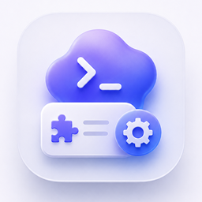

# Codex 技能管理器



Codex 技能管理器是一个面向 Windows 的本地桌面应用，用来扫描、查看、导入、启用和禁用本机 Codex / Agent Skills。

> 说明：这是非官方项目，不是 OpenAI 或 Codex 官方产品。它管理的是你电脑文件系统里的 skills，不会修改 Codex 官方服务。

## 适用人群

- 经常使用 Codex、Claude Code、Cursor、Gemini CLI 等工具的用户。
- 本机有很多 `SKILL.md`，想集中整理、打开、关闭和导入。
- 想把 GitHub 上的 skills 快速安装到本地托管目录。
- 想用 AI 帮忙总结每个 skill 的用途、风险和启用建议。

## 当前版本

当前版本：`v0.1.5`

已验证：

- Windows 10 / Windows 11
- x64

暂不保证：

- macOS / Linux
- Windows ARM
- 公司电脑的严格杀毒、白名单、只读目录或权限管控环境
- 网络盘、重定向用户目录等特殊环境

## 下载安装

请到 GitHub Releases 下载：

- `Codex-Skills-Manager-0.1.5-x64.exe`：便携版，下载后直接双击运行。
- `Codex-Skills-Manager-0.1.5-x64.zip`：压缩包，适合放到共享目录或局域网分发。

首次运行时，Windows 可能提示“未知发布者”。这是因为当前版本还没有代码签名证书。

## 核心功能

### 1. 自动扫描本机 skills

应用启动后会扫描当前 Windows 用户下的这些目录：

```text
%USERPROFILE%\.codex\skills
%USERPROFILE%\.agents\skills
%APPDATA%\CodexSkillsManager\imported-skills
```

每台电脑、每个 Windows 用户看到的都是自己的本地 skills。

### 2. 真实打开和关闭 skill

卡片右上角的开关不是纯 UI 状态，而是真实文件级开关：

```text
打开：SKILL.md.disabled -> SKILL.md
关闭：SKILL.md -> SKILL.md.disabled
```

注意：

- 已经运行中的 Codex 会话可能不会立刻重新加载 skills。
- 更稳妥的做法是关闭或打开 skill 后，重启 Codex 或开启新会话。
- 如果同一个 skill 在多个目录都有副本，需要分别管理对应副本。

### 3. 技能列表和详情

应用会展示：

- skill 名称
- 中文用途摘要
- 来源目录
- 当前状态
- 文件路径
- 校验问题
- 标签、风险和 AI 建议
- `SKILL.md` 原文内容

支持搜索、来源筛选、状态筛选、排序和分页。

### 4. 导入本地 skill 文件夹

点击“导入单个文件夹”，选择包含 `SKILL.md` 的目录。

导入规则：

- 导入后复制到 AppData 托管目录。
- 默认保持关闭，需要用户手动打开。
- 不会删除或移动原始文件夹。

### 5. 托管本机 skills

“托管本机技能”会把本机扫描到的 skills 复制到：

```text
%APPDATA%\CodexSkillsManager\imported-skills
```

这个功能适合整理、备份和统一管理。托管副本默认按照源状态同步，不会随意删除原目录。

### 6. 从 GitHub 导入

支持粘贴这些链接：

- GitHub 仓库链接
- GitHub `tree` 文件夹链接
- GitHub `blob/SKILL.md` 文件链接
- `raw.githubusercontent.com/.../SKILL.md` 链接
- Markdown 里的 GitHub 链接

导入后的 GitHub skill 默认关闭。你确认后再手动打开。

### 7. 在线 Skills 广场

技能广场用于发现网上的 skills：

- 浏览内置 GitHub 技能来源。
- 搜索公开 skills。
- 从具体技能卡片一键导入。
- 点击左侧来源只会切换本地索引筛选，不会马上深度扫描整个远程仓库。
- 只有点击“扫描来源 / 刷新来源”时才会联网读取该来源。
- 每个来源会显示未扫描、可浏览、未发现、扫描失败或外部目录状态。

GitHub 匿名 API 可能被限流。应用会优先使用本地缓存；具体导入仍需要网络。

### 8. AI 辅助识别

可以让 AI 帮你总结当前页 skills：

- 中文用途
- 适用场景
- 标签
- 风险等级
- 依赖和注意事项
- 是否建议启用

支持的 provider 包括：

- MiniMax
- OpenAI
- Anthropic
- Gemini
- DeepSeek
- Qwen
- Kimi
- Groq
- Mistral
- xAI
- OpenRouter
- SiliconFlow
- 自定义 OpenAI 兼容中转站
- 自定义 Anthropic 兼容中转站

API Key 只保存在当前 Windows 用户数据目录中。应用不会把 API Key 写进源码、README 或日志。

### 9. 一键修复

一键修复只处理保守、安全的常见问题，例如：

- 清理失效 registry 记录。
- 解决 `SKILL.md` / `SKILL.md.disabled` 同时存在的冲突。
- 为明显缺失 frontmatter 的文件补齐基础信息。

一键修复不会删除 skill 目录。

## 安全边界

- 应用不会执行 skill 里的脚本。
- 应用只读取 `SKILL.md`，或在用户明确操作时切换 `SKILL.md` 文件名。
- GitHub 导入会把远程文件下载到 AppData 托管目录。
- 托管状态保存到：

```text
%APPDATA%\CodexSkillsManager
```

## 常见问题

### 关闭 skill 后，Codex 会马上不用它吗？

新启动的 Codex 会话会看到最新文件状态。已经运行中的会话可能已经加载了旧 skills，需要重启 Codex 或开启新会话。

### 为什么 Windows 提示未知发布者？

因为当前版本还没有代码签名证书。以后如果正式分发，可以购买代码签名证书并接入打包流程。

### 可以给局域网其他人用吗？

可以。把 release 里的 exe 或 zip 发给对方即可。每个人运行后都会扫描自己电脑上的 skills。

### 会不会上传我的本地 skills？

不会。扫描、开关、AI 设置和托管目录都在本机。只有你主动从 GitHub 导入或使用 AI 识别时，才会访问网络。

## 本地开发

安装依赖：

```powershell
npm install
```

启动开发版：

```powershell
npm run dev
```

测试：

```powershell
npm run test:run
```

类型检查：

```powershell
npm run typecheck
```

构建：

```powershell
npm run build
```

打包 Windows 便携版和 zip：

```powershell
npm run dist
```

产物输出到：

```text
release/
```

## 已知限制

- 当前只打包 Windows x64。
- 当前没有代码签名。
- 当前不直接修改 Codex 原生配置或当前会话注入结果。
- 当前没有 ZIP/Git 批量导入。
- 当前没有完整操作日志和状态备份/恢复功能。

## 许可证

MIT
